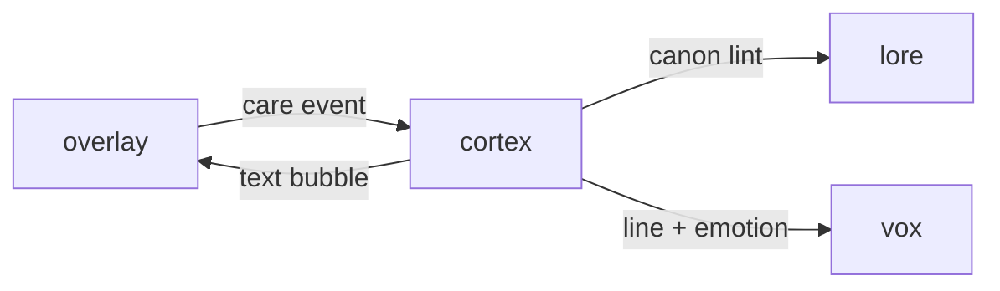

# Cortex

**Conversation that sounds like your pet.**

A planned pet dialogue service using species personas, care events, short-term memory, and defined fallback behavior.

**Stage: design scaffold.** This checkout contains a design document and a source placeholder. The experience below is planned; there is no runnable app or integrated service yet.

[Status](#status) · [Planned experience](#planned-experience) · [Contributor quickstart](#contributor-quickstart) · [Service contract](docs/CONTRACT.md) · [Ecosystem map](https://github.com/RicheyWorks/computerpets-ecosystem)

## Status

| Available today | What you can inspect |
| --- | --- |
| [Service contract](docs/CONTRACT.md) | Intended behavior, boundaries, and planned dependencies. |
| [Source placeholder](src/cortex/__init__.py) | Package metadata at version 0.0.0; no application entry point or packaging manifest is checked in. |
| [MIT license](LICENSE) | Licensing terms for the repository. |

Gameplay, endpoints, integration arrows, and failure handling on this page describe implementation targets. No build/test harness, CI workflow, or product screenshots are included in this scaffold.

## Planned experience

- POST /v1/speak — given petId + event (fed, poked, ignored), return a line + emotion tag
- POST /v1/chat — multi-turn player chat with a species system prompt and short-term memory
- GET /v1/persona/{speciesId} — locked voice, vocabulary, taboo list for that animal
- POST /v1/moderate — drop or rewrite lines that break canon or safety policy

### Planned technology

Python 3.12 · FastAPI · xAI Grok / local vLLM · Redis session memory · gRPC to the desktop client

### Planned connections

These arrows show intended dependencies, rather than working integrations.



## Contributor quickstart

With access to this private repository, Git and PowerShell are enough to review the scaffold:

```powershell
git clone https://github.com/RicheyWorks/computerpets-cortex.git
Set-Location computerpets-cortex
Get-Content docs/CONTRACT.md
Get-Content src/cortex/__init__.py
```

Read [Service contract](docs/CONTRACT.md) before choosing implementation details. The commands above inspect the checked-in files; app installation, editor launch, and server startup become possible after a buildable project and entry point are added.

### First implementation target

**Rui persona JSON + `POST /v1/speak` for fed/poked/ignored. Three canned fallbacks if the model is down.**

You know it works when: Rui and Paint never share a sentence. Timeout returns a bark, HTTP 200. Unknown speciesId returns critter, never 'red panda'.

Treat this as an acceptance target for a future implementation. Start with the documented slice, add the required project setup and focused tests, and update these instructions with commands that work from a fresh clone.

## Design boundaries

- Stay canon with 210 species. No illegal hybrids. No swapped voices.
- Treat the desktop overlay as the main quest. This organ is optional until wired.
- Fail soft: the overlay keeps walking if this service is down, unless this *is* the overlay.
- No PII in public artifacts (Steam id, wallet, home path, webcam frames).

**Required failure behavior:**

Model timeout → canned species bark. Safety trip → silent emote only. Unknown species → generic 'critter' prompt, never another animal's voice.

## Ecosystem

- [computerpets](https://github.com/RicheyWorks/computerpets) (desktop + Spring backend)
- [computerpets-vox](https://github.com/RicheyWorks/computerpets-vox) (spoken replies)
- [computerpets-quests](https://github.com/RicheyWorks/computerpets-quests) (daily prompts)
- [computerpets-lore](https://github.com/RicheyWorks/computerpets-lore) (canon facts)

Start with the [ComputerPets flagship](https://github.com/RicheyWorks/computerpets) for the desktop pet. This repository describes an optional extension; the [ecosystem map](https://github.com/RicheyWorks/computerpets-ecosystem) explains the broader plan.

## License

MIT. See [LICENSE](LICENSE).
