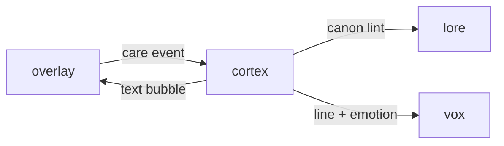

# Cortex

**LLM Pet Brain** — NLP service for dynamic, unscripted pet conversations across all 210 species.

Part of [ComputerPets](https://github.com/RicheyWorks/computerpets). Map: [computerpets-ecosystem](https://github.com/RicheyWorks/computerpets-ecosystem).

| | |
| --- | --- |
| Status | Design scaffold — contract frozen, implementation next |
| License | MIT |
| First pet | Still [Rui on the desktop](https://github.com/RicheyWorks/computerpets/blob/main/docs/START-HERE.md). This organ is optional. |

## The job

Turns hunger, mood, lineage, and player context into in-character speech. Rui does not lecture. A clownfish does not talk like a frog. Cortex is the mouth of the overlay.

The flagship overlay already puts a living sticker on the real desktop (Rui first, 210 kinds). Cortex does not replace that. It is one organ.

## Who uses it

Overlay + Companion when a pet should talk. Not the player-facing website.

## What it is not

Not a general chatbot. Not a replacement for the desktop pet. Will not invent a 211th species.

## Architecture



## Stack

Python 3.12 · FastAPI · xAI Grok / local vLLM · Redis session memory · gRPC to the desktop client

GroupId / namespace: `com.enterprisepet.cortex`  
Default listen: `8091`

## Contract

### Data

`Persona(speciesId, voice, temperament, taboo[]) · Utterance(petId, text, emotion, seed) · MemoryWindow(petId, turns[8])`

### Surface

- POST /v1/speak — given petId + event (fed, poked, ignored), return a line + emotion tag
- POST /v1/chat — multi-turn player chat with a species system prompt and short-term memory
- GET /v1/persona/{speciesId} — locked voice, vocabulary, taboo list for that animal
- POST /v1/moderate — drop or rewrite lines that break canon or safety policy

### Failure doctrine

Model timeout → canned species bark. Safety trip → silent emote only. Unknown species → generic 'critter' prompt, never another animal's voice.

## First slice

Build this and stop. Do not boil the ocean.

**Rui persona JSON + `POST /v1/speak` for fed/poked/ignored. Three canned fallbacks if the model is down.**

You know it works when: Rui and Paint never share a sentence. Timeout returns a bark, HTTP 200. Unknown speciesId returns critter, never 'red panda'.

## Environment

`XAI_API_KEY` (or `VLLM_URL`), `REDIS_URL`, `LORE_URL`

Never commit secrets. Never put Steam or chain keys in the overlay.

## Neighbors

- computerpets (desktop + Spring backend)
- computerpets-vox (spoken replies)
- computerpets-quests (daily prompts)
- computerpets-lore (canon facts)

## Layout

```
computerpets-cortex/
  README.md           this file
  LICENSE             MIT
  docs/CONTRACT.md    the same contract, frozen for implementers
  src/                implementation lands here
```

## Run (Windows)

PowerShell, from this folder, after the flagship helpers (Git, Node LTS 22+, JDK 21 as needed):

```powershell
python -m venv .venv; .\.venv\Scripts\Activate.ps1; pip install -e .; uvicorn cortex.app:app --port 8091
```

You do not need this service to meet Rui. The [flagship start-here](https://github.com/RicheyWorks/computerpets/blob/main/docs/START-HERE.md) is still the first pet.

## Links

- Flagship: [RicheyWorks/computerpets](https://github.com/RicheyWorks/computerpets)
- This repo: [RicheyWorks/computerpets-cortex](https://github.com/RicheyWorks/computerpets-cortex)
- Map: [RicheyWorks/computerpets-ecosystem](https://github.com/RicheyWorks/computerpets-ecosystem)
- Contract file: [docs/CONTRACT.md](docs/CONTRACT.md)

## License

MIT. See [LICENSE](LICENSE).

---

*Two hundred ten living kinds. Keep them so a line does not go quiet.*
